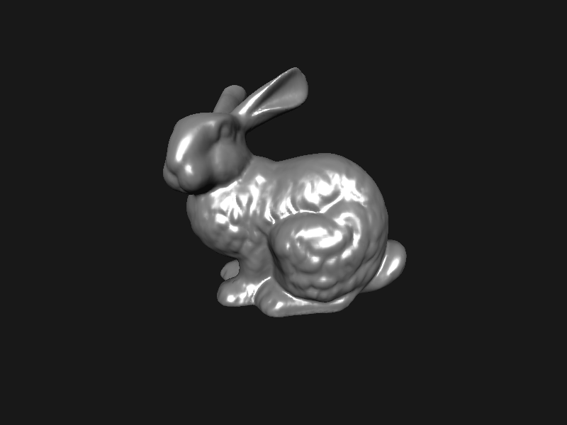

# Rust Graphics
A tiny per-pixel 3D rendering engine.

## Checklist
- [x] depth buffer
- [x] triangle rasterization
- [x] perspective-correct interpolation
- [x] UV mapping
- [x] lighting (Phong shading)
- [x] model loading (.obj)